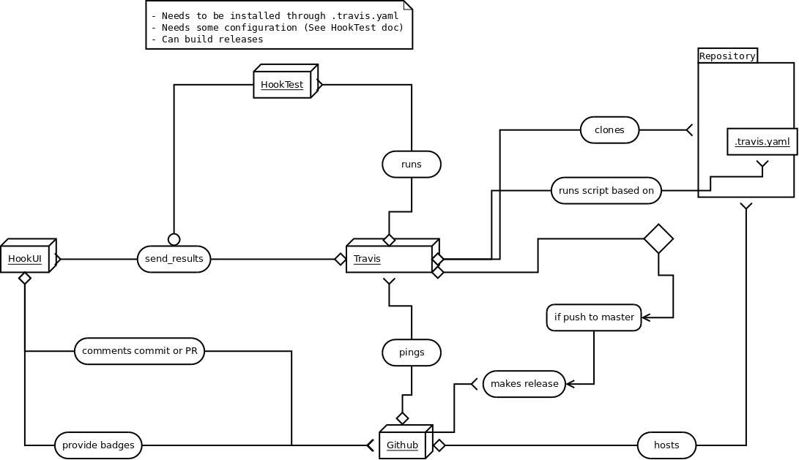

Hook (Web Interface for HookTest+Travis)
====

## What's Hook ?

Hook is a User Interface design to improve the reuse of [HookTest](https://github.com/capitains/HookTest) tests results.

It serves as a third party application, installed as a flask extension, and communicates with both Travis and Github. 

## Workflow

